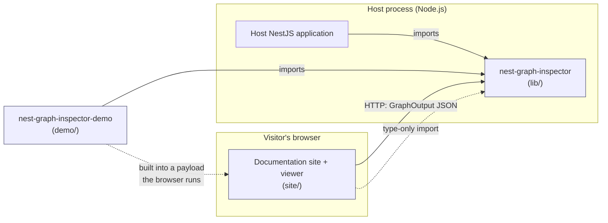
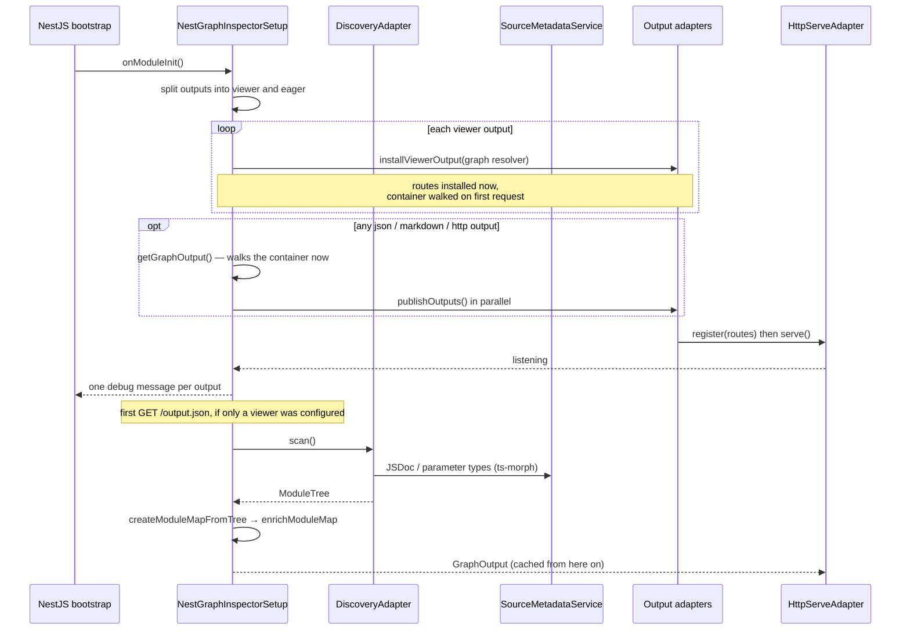
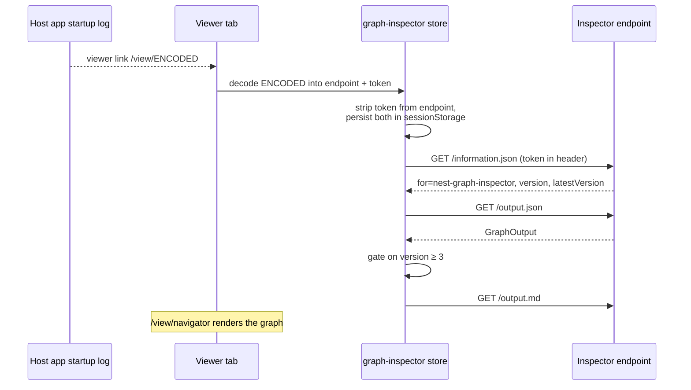

# Architecture — Nest Graph Inspector

**Read this before changing anything.** It maps how the three packages fit
together, which surfaces are contracts, and which defaults are deliberate.
Where this document and the code disagree, the code wins and the document is
the bug — fix it in the same pull request.

Narrower companion documents:

| Document | Scope |
|---|---|
| [`public-api.md`](./public-api.md) | Every symbol exported from `lib/src/index.ts` |
| [`graph-contract.md`](./graph-contract.md) | The `GraphOutput` JSON shape, field by field |
| [`development-guidelines.md`](./development-guidelines.md) | Where a change belongs, how to test it |
| [`maintainers-guide.md`](./maintainers-guide.md) | Directory-by-directory ownership |
| [`technical-debt-report.md`](./technical-debt-report.md) | Known debt, prioritised |

---

## The system in one paragraph

Once imported into a host application, Nest Graph Inspector reads the live
dependency-injection container NestJS already built, turns it into a
framework-agnostic JSON document called `GraphOutput`, and hands it to one or
more output adapters: a file on disk, a Markdown report, an HTTP endpoint
inside the host process, or the hosted interactive viewer. The viewer is a
separate Nuxt application that knows nothing about NestJS — it fetches
`GraphOutput` over HTTP and renders it. The whole design turns on that one
seam.

---

## Repository layout

```
nest-graph-inspector/        ← monorepo root (pnpm workspace)
├── lib/                     ← the published npm package — this is the product
│   └── src/
│       ├── adapters/        ← output channels and container discovery
│       ├── ports/           ← the interfaces adapters implement
│       └── types/           ← public types + the JSON Schema
├── demo/                    ← private NestJS app: development host and showcase
│   ├── src/                 ← an ordinary NestJS application
│   ├── scripts/             ← packages that application for the browser
│   ├── test/                ← e2e tests, including network-level security tests
│   └── docs/                ← legacy demo documentation
├── site/                    ← Nuxt 4 documentation site + interactive viewer
│   ├── app/                 ← Nuxt app directory (pages, stores, components)
│   ├── content/             ← MDC documentation pages
│   ├── server/              ← Nitro routes and the docs MCP server
│   ├── scripts/             ← payload verification
│   └── public/nodepod-demo/ ← generated demo payload (gitignored)
├── docs/                    ← repository-level design docs (this file)
└── .github/workflows/       ← CI, publish, deploy
```

Workspace members ([`pnpm-workspace.yaml`](../pnpm-workspace.yaml)): `demo`,
`lib`, `site`. The root `package.json` is private and holds no source; its
scripts fan out across the workspace, and their ordering is not cosmetic — see
[Build, test, release](#build-test-release).

---

## The three packages and the direction of dependency



Three rules follow, each enforceable by reading a `package.json`:

1. **`lib/` depends on nothing in this repository.** Its only runtime
   dependency is `ts-morph`; `@nestjs/common` and `@nestjs/core` are peers. It
   must never gain a frontend dependency.
2. **`site/` depends on `lib/` for types only.** `site/package.json` lists
   `"nest-graph-inspector": "workspace:*"`, and the site imports only from the
   public entry point — `import type { GraphOutput } from
   'nest-graph-inspector'` — never an internal source path. At runtime it holds
   no NestJS code; it speaks HTTP.
3. **`demo/` is not the library.** It consumes the package as a user would,
   through its built entry points. Production logic does not belong here.

Both `demo/` and `site/` resolve `nest-graph-inspector` through `lib/dist`,
which does not exist in a fresh checkout — so CI and every root script build
the library before anything type-aware runs against them (see
[Build, test, release](#build-test-release)).

---

## The two contracts that span packages

Changing one side of either of these alone breaks the other.

### 1. The public API — `lib/src/index.ts`

Everything re-exported there is public: adding is a feature, changing or
removing is breaking. It currently exports the module and its options types,
the graph output types and JSON Schema, the Direct Run and runtime-trace types,
and the access-token/rate-limiter surface (`AccessTokenService`,
`AccessAttemptLimiter`, and their constants) so an application can mint its own
tokens. Keep [`public-api.md`](./public-api.md) in step.

Several classes — `NestGraphInspectorSetup`, `RuntimeTraceRecorder`, the
adapters, the port interfaces — are reachable by deep import but are *not* in
`index.ts`. They are internal; treat a deep import in user code as unsupported.

### 2. The graph output JSON — `GraphOutput`

Produced by `lib/`, consumed by the viewer in `site/`. It is versioned:

| Constant | Location | Value |
|---|---|---|
| `GRAPH_OUTPUT_SCHEMA_VERSION` | `lib/src/types/graph-output.schema.ts` | `'3'` |
| `MINIMUM_SUPPORTED_GRAPH_OUTPUT_VERSION` | `site/app/utils/graph-output-support.ts` | `3` |

A breaking change to the shape must bump the library constant, update
`GRAPH_OUTPUT_JSON_SCHEMA` (including its `$id`, which carries the version),
raise the viewer's minimum, and update
[`graph-contract.md`](./graph-contract.md) — in one pull request. Rather than
render a graph whose version it does not support, the viewer shows an "update
your package" modal, so a half-done bump is visible to users immediately.

---

## `lib/` — the published package

### Ports and adapters

The library is ports and adapters, thinly applied. One port:

- `OutputAdapter<Config>` (`lib/src/ports/output.adapter.ts`) —
  `execute(graphOutput, config): Promise<{ message: string }>`, implemented by
  every output channel. `NestGraphInspectorSetup` logs the returned `message`
  at `debug` level.

Not everything under `adapters/` is an output adapter — the directory name is
looser than the port. `DiscoveryAdapter` reads the container, `HttpServeAdapter`
is the HTTP server itself, and `DirectRunOutputAdapter` builds routes rather
than implementing the port.

### Component inventory

| Component | File | Role |
|---|---|---|
| `NestGraphInspectorModule` | `nest-graph-inspector.module.ts` | `@Module` entry point; owns `defaultOptions`; exports `AccessTokenService` |
| `ConfigurableModuleClass` | `nest-graph-inspector.config.ts` | Nest's `ConfigurableModuleBuilder`, giving `forRoot` / `forRootAsync` |
| `NestGraphInspectorSetup` | `nest-graph-inspector.setup.ts` | `OnModuleInit`; orchestrates extraction, enrichment, and dispatch |
| `DiscoveryAdapter` | `adapters/discovery.ts` | Walks `ModulesContainer` into a `ModuleTree`; instruments providers for tracing |
| `SourceMetadataService` | `source-metadata.service.ts` | ts-morph project; JSDoc and parameter-type lookup by class name |
| `RuntimeTraceRecorder` | `runtime-trace.recorder.ts` | Records call spans via `AsyncLocalStorage` |
| `AccessTokenService` | `access-token.service.ts` | Mints, verifies, and guards with HMAC-signed tokens |
| `AccessAttemptLimiter` | `access-attempt-limiter.ts` | Per-client lockout for repeated invalid tokens |
| `HttpServeAdapter` | `adapters/http-serve.adapter.ts` | Standalone `node:http` server and router; no Express/Fastify |
| `HttpOutputAdapter` | `adapters/http-output.adapter.ts` | Registers the four graph routes; owns the host/port defaults |
| `ViewerOutputAdapter` | `adapters/viewer-output.adapter.ts` | Composes HTTP + Direct Run; prints the viewer link |
| `FileOutputAdapter` | `adapters/file-output.adapter.ts` | Writes the Markdown report (Mermaid + prose) |
| `JsonOutputAdapter` | `adapters/json-output.adapter.ts` | Writes raw `GraphOutput` JSON |
| `DirectRunOutputAdapter` | `adapters/direct-run-output.adapter.ts` | Builds the routes that invoke provider methods |
| `createInspectorEndpointInfo` | `inspector-endpoint-info.ts` | Builds the `information.json` handshake payload |

Intermediate types under `types/` — `ModuleMap`, `Modules`, `ModuleProvider`,
`ModuleController` — are the *pre-enrichment* representation. They are not the
contract; `GraphOutput` is.

### Startup sequence



**Viewer outputs are lazy; every other output is eager.** The viewer installs
its endpoints at bootstrap but resolves the graph on the first request — that is
what `GraphOutputSource` (a value *or* a resolver) in `http-output.adapter.ts`
is for: a host application should not pay to walk the container and run ts-morph
over the sources at startup if nobody ever opens the viewer. Add a `json`,
`markdown`, or `http` output and the container *is* walked at bootstrap,
because those adapters need a graph to write. Either way the result is cached
in a field and built once per process.

**Outputs are dispatched in parallel.** `publishOutputs` is a `Promise.all` over
the eager outputs, and the viewer installs run as their own `Promise.all` before
them. No output may depend on another having run.

**A failing output never fails the application.** Both `publishSingleOutput`
and `installViewerOutput` catch, log an error, and return: an inspector that
cannot bind its port must not stop a host application from starting. So a
broken output is a log line, not a crash, and easy to miss.

### Discovery and enrichment

`DiscoveryAdapter.scan()` produces a `ModuleTree`, and
`NestGraphInspectorSetup.enrichModuleMap()` turns it into `GraphOutput`:

1. **Find the root.** Either `options.rootModule`, or inferred by locating the
   module that imported the inspector.
2. **Walk the tree.** Imports, exports, providers, and controllers per module,
   with `ignoreImport` and `ignoreProvider` applied
   (`InternalCoreModule` and `NestGraphInspectorModule` hide themselves by
   default).
3. **Fold in NestJS core.** Providers named in `nestCoreProviders`
   (`ModuleRef`, `ApplicationConfig`, `Reflector`, `REQUEST`, `INQUIRER`) are
   collected under one virtual module named by `nestCoreModuleName`
   (`NestJSCoreModule`), so the graph does not sprout framework internals in
   every real module.
4. **Resolve dependencies.** Constructor parameters *and* property-injected
   `@Inject()` members resolve from injection tokens to a
   `GraphOutputDependencyRef` carrying `token` plus the `providedBy` module.
5. **Enrich from source.** `SourceMetadataService` opens the application's own
   `.ts` files with ts-morph to attach JSDoc to modules, providers, and
   controllers, and to render Direct Run parameter types as TypeScript source
   text. Best-effort: no sources found means no JSDoc, not a failure.
6. **Detect cycles.** Three separate passes — modules, providers, controllers —
   each classified `direct` or `indirect`, with a canonical key so the same
   cycle is not reported once per rotation. Provider cycles carry a richer path
   (`{ module, provider }` items) than module and controller cycles (plain
   name strings); that asymmetry is real and known
   ([TD-10](./technical-debt-report.md)).

### Output adapters and the route table

`defaultOptions` configures a single `viewer` output on
`HttpOutputAdapter.defaultConfig` — **host `0.0.0.0`, port `53371`**.

| Output | Config | Effect |
|---|---|---|
| `json` | `{ path }` | Writes `GraphOutput` as JSON, relative to `process.cwd()` |
| `markdown` | `{ path }` | Writes a Mermaid diagram plus a per-module report, and an `information.json` beside it |
| `http` | `{ origin?, host?, port?, path? }` | Registers the four graph routes; default path `/__nest-graph-inspector` |
| `viewer` | `{ origin?, host?, port?, path?, directRun? }` | `http` + Direct Run + prints the viewer link; default path `/__graph-inspector` |

Everything a `viewer` output installs, on one server:

| Method | Path (relative to the output's `path`) | Serves |
|---|---|---|
| `GET` | `/information.json` | Handshake: `for`, `is-static`, `version`, `latestVersion`, `isLatestVersion` |
| `GET` | `/output.json` | `GraphOutput` |
| `GET` | `/output.schema.json` | `GRAPH_OUTPUT_JSON_SCHEMA` |
| `GET` | `/output.md` | The Markdown report |
| `POST` | `/direct-run` | Invokes `{ module, provider, method, args }` |
| `GET` | `/direct-run/histories` | Every completed `RuntimeTrace` |
| `GET` | `/direct-run/history/index.json` | Trace summaries |
| `GET` | `/direct-run/history/*` | One trace by id |

`information.json` is the handshake the viewer probes with: the site treats a
response whose `for` is `nest-graph-inspector` as proof it has found an
inspector. Its `is-static` flag says which kind of source answered — the
`markdown` output writes the same payload beside its file with
`is-static: true`, so a graph read from disk is distinguishable from one served
by a running application, letting the viewer hide what only a live process can
do.

`latestVersion` comes from an npm registry lookup bounded to **2 seconds**
(`LATEST_VERSION_TIMEOUT_MS`) and memoised per process. Unbounded, it would
hold up the host application's own startup on a network that blackholes rather
than refuses — and that awaited `fetch` is also what keeps the in-browser
demo's event loop alive long enough to boot.

`HttpServeAdapter` keys routes by `"METHOD path"` and supports `*` for either
half plus trailing-`/*` prefixes. Several outputs may register against the same
origin; the server is created once and started once.

### Security architecture

The inspector serves the shape of an application's internals from inside that
application, and Direct Run invokes real provider methods on request. The
defaults below are deliberate: when you touch `http-serve.adapter.ts` or
`direct-run-output.adapter.ts`, question them rather than treating them as
inherited noise.

**Access tokens are on by default.** `AccessTokenService.createHttpGuard()` is
attached to every route the inspector registers — graph and Direct Run alike.

| Property | Value |
|---|---|
| Format | `ngi1.<base64url payload>.<HMAC-SHA256 signature>` |
| TTL | 3 hours (`DEFAULT_ACCESS_TOKEN_TTL_MS`) |
| Secret | `accessToken.secret`, else `NEST_GRAPH_INSPECTOR_TOKEN_SECRET`, else a random per-process secret |
| Minimum safe secret | 32 characters — a short one is recoverable offline from a single leaked token |
| Transports | `Authorization: Bearer`, `x-graph-inspector-token`, `?__inspector_token=` |
| Comparison | Constant-time (`timingSafeEqual`) |

The token rides in the printed viewer link, so the hosted viewer carries it
into every follow-up request without anyone copying it by hand — which leaves a
live credential in the startup log. Hence `accessToken.logToken: false`, for
environments that ship logs somewhere the token should not reach; turning it
off means supplying your own `secret` and minting tokens yourself, and the
printed link is then deliberately incomplete.

**Brute force is capped, not merely rejected.** `AccessAttemptLimiter` keys on
the socket's remote address — never a forwarded header, which a caller can set:

| Default | Value |
|---|---|
| `maxFailures` | 10 per window |
| `windowMs` | 60 000 ms |
| `blockMs` | 15 minutes, answered `429` with `Retry-After` |
| `maxTrackedClients` | 1 000, so the tracker cannot itself be grown without limit |

Only a genuine *guess* counts: a request with no token, or with a real token
that has expired, is not counted. Behind a reverse proxy every request arrives
with the proxy's address, so one attacker can lock everyone out for `blockMs`;
lower it or disable the limiter in that topology.

**The library forwards nothing.** It used to install a proxy on the viewer
output that took a caller-supplied body and sent it to a local Ollama daemon,
hardened against being turned into an open relay. The AI chat now runs the model
in the visitor's browser, so that endpoint — and the request-forwarding surface
it carried — is gone rather than defended.

**Two things are wide open on purpose.** The viewer's CORS policy allows every
origin (`origins: [/.*/]`), and the default bind interface is `0.0.0.0`. The
viewer is hosted on GitHub Pages while the inspector runs on the developer's
machine, so a same-origin policy would make the product impossible; the token
guard, not the origin check, is what makes that safe. Preflight is answered
without a token by design — a browser sends no credentials on a preflight —
which `demo/test/graph-inspector-security.e2e-spec.ts` asserts explicitly,
along with the lockout behaviour, over real TCP.

### Direct Run and runtime tracing

Direct Run turns the viewer into something that *does* things rather than only
showing them: a `POST /direct-run` with `{ module, provider, method, args }`
looks the provider instance up in the live container and calls the method.

Around that call `RuntimeTraceRecorder` builds a trace. `DiscoveryAdapter`
instruments provider instances once (tracked in a `WeakSet`, so wrapping is
never doubled), and each instrumented method opens a span. Two
`AsyncLocalStorage` stores — one for the active trace, one for the span stack —
give the nesting, so a call graph several providers deep is reconstructed
without explicit plumbing. A method returning a promise gets its span settled
when the promise settles; a span whose promise nobody awaited is marked rather
than lost, which is why `RuntimeTraceStatus` has a `partial` state alongside
`success` and `error`. Traces are kept in memory, and written to disk too when
a `json` output is configured — `viewer-output.adapter.ts` derives the history
directory from that output's path.

---

## `demo/` — development host and showcase

`demo/src` is an ordinary NestJS application with four feature modules — User,
Product, Order, Mobile — and an inspector running all four output types at once
(viewer on `localhost:53371`, a second plain `http` output on
`localhost:53372/graph`, Markdown and JSON into `demo/tmp/graph/`).

Its module graph is deliberately awkward, because a graph tool needs something
worth graphing:

- **A module-level cycle**: `OrderModule` ⇄ `UserModule` via `forwardRef`.
- **A provider-level cycle**: `OrderService` ⇄ `OrderNotificationService`,
  resolved with `forwardRef` inside `@Inject()`.
- **A second cycle through Mobile**: `ProductModule` ⇄ `MobileModule`.
- **A useless import**: `ProductModule` imports `UserModule` and uses nothing
  from it, on purpose, to check the inspector reports it.
- **A third-party module**: `ConfigModule.forRoot()` inside `MobileModule`, so
  the graph contains something the repository does not own.

`demo/test/` holds two e2e suites: an application-level one exercising the
demo's own REST routes *and* then reading the token-gated graph endpoint over
TCP, and the network-level security suite described above, which boots the real
module and probes it over real sockets.

**Neither runs by default.** They live behind `pnpm --filter
nest-graph-inspector-demo run test:e2e` with their own Jest config, while the
demo's plain `test` script is scoped to `src/` and passes with no tests. Root
`pnpm run test` — and therefore CI — does not reach them. Change anything in
the security surface and you must run `test:e2e` yourself; nothing else will.

The application knows nothing about the documentation site, deliberately: it is
a NestJS project you could copy elsewhere and run unchanged. Everything the
browser needs differently lives in the payload build.

---

## `site/` — documentation and viewer

A Nuxt 4 application deployed to GitHub Pages under the base path
`/nest-graph-inspector/`. It carries four surfaces.

### 1. The documentation site

MDC pages under `site/content/`, rendered by `@nuxt/content` through
`app/pages/[...slug].vue`, with numeric directory prefixes driving navigation
order. Beyond the pages:

- `server/routes/raw/[...slug].md.get.ts` serves any doc page back as raw
  Markdown, for tools and for LLM consumption.
- `server/mcp/tools/` exposes `list-pages` and `get-page` as an MCP server
  (`@nuxtjs/mcp-toolkit`), so an agent can read the documentation directly.
- `nuxt-llms` generates `llms.txt` from the same collections.
- `app/components/content/*.vue` are the live previews embedded in prose — they
  are not screenshots; they run the demo.

### 2. The interactive viewer



**A viewer URL names a view, not a graph** — the part of the routing model
most easily got wrong. `/view/<encoded>` carries a bootstrap link once, on
arrival; `resolveViewerBootstrap` decodes it, and the tab keeps the endpoint
and token in `sessionStorage` under `nest-graph-inspector:session` — session
rather than local storage deliberately, so the credential is scoped to one tab
instead of shared across every tab in the browser.

The token never goes back into a URL: it lives in the Pinia store and leaves
only as the `x-graph-inspector-token` header, added by a `$fetch` instance that
reads it per request. `probeEndpoint` — used by the `/view` entry page to guess
at a local inspector — pointedly does *not* use that authenticated fetch, so
probing a host never hands it a live credential for another one.

The viewer pages are `navigator` (the Vue Flow graph), `issues` (circular
dependencies), and `execution-sequence` (Direct Run traces as a Mermaid
sequence diagram). `nuxt.config.ts` renders `/view/**` client-side only —
neither the tab's session nor the developer's local endpoint exists on a server
— while `/view` itself keeps SSR so it still unfurls as a link.

Rendering stack: Vue Flow for the graph, Mermaid for sequence diagrams, Monaco
for JSON editing, ApexCharts for timings, and LangChain over `@mlc-ai/web-llm`
for the AI chat panel.

**The graph carries the application's own documentation.** Every module,
provider and controller in `GraphOutput` may hold a `jsdoc` string —
`SourceMetadataService` reads it from the sources with ts-morph — and
`GraphViewer.vue` shows it in a hover card when the pointer rests on a module
title or an item node. The library extracts a class's *description* only, so
block tags such as `@param` never reach the viewer; `jsdoc-preview.ts` parses
what does arrive into paragraphs and bullet lists, and a node with nothing
documented opens no card and carries no dotted underline. The card is placed by
`hover-card-position.ts` against the viewer's own box rather than the window's,
because the viewer hides its overflow. It is on by default; "Show JSDoc on
hover" in the graph settings panel turns it off.

### 3. The in-browser demo

Everything the site shows as a demo — the previews in the documentation pages,
and "Open Demo" on `/view` — is the `demo/` application actually running, on
the [nodepod](https://www.npmjs.com/package/@scelar/nodepod) browser-native
Node.js runtime, in the visitor's own tab. Nothing is captured ahead of time:
Direct Run really invokes provider methods, runtime traces really accumulate,
and the JSDoc and parameter types in the graph come from the sources of the
application that is answering.

**The payload.** `demo/scripts/build-nodepod-payload.ts` writes three files
into `site/public/nodepod-demo/`:

| File | What it is |
|---|---|
| `main.js` | The whole demo application bundled into one CommonJS file (~17 MB, ~2 MB gzipped) |
| `sources.json` | The demo's `.ts` sources plus a flattened `tsconfig.json`, so the library's ts-morph source reader still finds JSDoc and Direct Run parameter types |
| `manifest.json` | Revision, working directory, entry file, and the environment the application is started with |

**Two constraints shape this design.**

1. **Decorator metadata forces a tsc-then-bundle pipeline.** Nest resolves
   constructor dependencies from `emitDecoratorMetadata` output, and TypeScript
   is the only compiler in this repository that emits it. So the payload is
   built from the `nest build` output (`demo/dist/src/main.js`); esbuild only
   stitches the emitted JavaScript into a single file. Bundling the TypeScript
   directly would produce an application whose providers cannot be injected.
   Nest's optional peers (`@nestjs/microservices`, `@nestjs/websockets`,
   `class-validator`, `class-transformer`) stay external, so a missing feature
   fails where it would fail on a real machine.
2. **The service-worker scope rule forces a fetch bridge.** nodepod would
   rather serve its virtual HTTP servers through a service worker, but it
   registers that worker with scope `/`, and GitHub Pages serves the site from
   `/nest-graph-inspector/` and cannot answer with `Service-Worker-Allowed`.
   The pod is therefore booted headless, and requests to the demo's servers are
   addressed under `<site base>/__nodepod__/<port>/…` and answered in the tab by
   a `fetch` bridge that calls `pod.request(port, …)`.
   `site/app/utils/nodepod-demo-endpoint.ts` owns that address space and is
   covered by `nodepod-demo-endpoint.test.ts`.

**What checks it.** `pnpm --filter nest-graph-inspector-site run
test:demo-payload` (`site/scripts/verify-nodepod-payload.ts`) boots the built
payload on the same runtime — headless, on `worker_threads` instead of Web
Workers — spawns it, and reads the graph endpoint out of the startup log with
the site's own parser. It is the only thing exercising the two couplings this
design rests on: that the bundle starts at all, and that the viewer link the
library prints is still in a shape the site can read. Every workflow that
generates the site runs it right after building the payload.

**Boot sequence.**

```
1. The visitor asks: "Run the demo application" in a docs preview, or "Open
   Demo" on /view
2. nodepod-demo store downloads manifest.json, main.js, and sources.json
3. Nodepod.boot({ files, workdir, env, headless: true })
4. The fetch bridge is installed for <site base>/__nodepod__/<port>/…
5. pod.spawn('node', ['main.js']) → the NestJS application starts
6. The store reads the printed viewer link out of the application's own startup
   log and treats it as the bootstrap credential it is: the endpoint keeps its
   path, rewritten onto the bridged address; the access token comes out of the
   URL and goes to the graph store, which sends it as a header from then on
7. /view puts both in the tab's session and opens /view/navigator, which loads
   the graph through the same HTTP contract as any other endpoint
```

Nothing starts on its own: downloading an application and booting a Node
runtime is not something a page should do because it was scrolled past, so
every entry point is a click. One pod then serves every preview on the page and
the viewer, so the payload is downloaded and the application booted once for as
long as it keeps running. A failure opens one dialog, wherever it was started
from, carrying what the application itself printed; the retry it offers, and
the recovery below, are what boot another one.

A reload restores the endpoint from the tab's session (a viewer page names a
view, not a graph) — and for the demo that endpoint is answerable only by the
tab that started it. `use-nodepod-demo-session.ts` recognises such an endpoint
and starts the demo again, which means a new port and a new token, so it
replaces the session rather than reusing it. A token the endpoint has begun refusing —
the demo's expires on the library's own schedule, and a tab left open outlives
it — is recovered the same way, except that the application behind it is still
running, so it is stopped first: joining it would only hand back the credential
that was just refused.

**What the payload build accommodates.** The bundle is prepended with a few
lines the application never sees, because the browser runtime differs from Node
in two ways it would otherwise fall over on:

- **Two `Buffer` implementations that do not recognise each other.**
  `require('buffer').Buffer` is not the global one, and each one's `isBuffer`
  rejects what the other made. Express builds a response body with one and
  hands it to `etag`, which checks with the other, so every response from the
  demo's own REST routes is a 500. The shim makes recognition symmetric and
  changes nothing about what is created.
- **A process ends when its event loop looks empty.** Neither a virtual HTTP
  server nor an in-flight cross-origin `fetch` holds it open, and the inspector
  awaits one during startup — the npm lookup behind `latestVersion` in
  `information.json` — so without a timer the application exits underneath its
  own bootstrap, before it ever prints a viewer link.

Both belong to the runtime, not to the application, which is why they live in
the build rather than in `demo/src`. `site/scripts/verify-nodepod-payload.ts`
calls one of the demo's own routes for exactly this reason: it is what fails
first when an accommodation stops working.

Known limitations, accepted deliberately:

- `SharedArrayBuffer` is unavailable without COOP/COEP headers, so nodepod
  falls back to full per-spawn snapshots.
- The payload is a few megabytes, downloaded once per visit.
- The pod lives as long as the page: nothing tears it down on a route change,
  and the keep-alive timer means it never idles out either.
- If the application stops after the graph has loaded, the viewer keeps showing
  that graph while every new request to it fails; the exit line in the demo
  console is the only signal.

### 4. The AI chat, which runs entirely in the browser

The assistant has no server side. `@mlc-ai/web-llm` downloads model weights from
HuggingFace into the browser's Cache API and runs inference on the visitor's GPU
through WebGPU, inside a web worker. The library's only contribution is the graph
Markdown the viewer already fetches from `/output.md`, which the site budgets
down to fit the model's context window before using it as the system prompt. The
graph, the question, and the answer never leave the machine, and nothing has to
be installed for the feature to work — at the cost of requiring a WebGPU-capable
browser, which the panel checks for before offering the chat.

**The chat talks to a LangChain model, not to web-llm.** The panel never calls
`@mlc-ai/web-llm`. It builds a `ChatWebLlm` — a LangChain `BaseChatModel`
wrapping the engine — and talks to that. The indirection buys one thing, and it
is the reason it exists: which model answers is a constructor argument. Putting
`@langchain/openai`, `@langchain/anthropic` or a later web-llm release behind the
same panel is a swap of one object, not a rewrite of the chat. In-browser
inference is the right default for a tool that discusses the developer's own
application, but it should not be the only thing this panel can ever do.

The seam is `WebLlmStreamer` in `app/utils/web-llm-boundary.ts`: two functions,
`streamChat` and `interrupt`. `useWebLlmEngine` fills them from web-llm and
`ChatWebLlm` reads them, and neither knows anything else about the other — which
is also what makes the chat model, and the entire agent loop above it, testable
in a plain node script against a scripted engine, with no browser, no GPU and no
downloaded weights.

**Tool calling is implemented on our side rather than delegated.** web-llm has
its own function-calling path, but it refuses any model outside a five-entry list
of Hermes builds — and reading what it does once it accepts one shows the list is
a bet, not a capability: it interpolates the tool schemas into a system prompt,
constrains the reply with a JSON grammar, and parses the result back. `ChatWebLlm`
does both of those directly, so tools bind to **every** model in the catalog,
including the recommended 2 GB one. Constrained decoding is the stronger half of
that: a fine-tune makes well-formed output likely, a grammar at the sampler makes
it certain. What neither fixes is judgement — a 1.7B model still picks the wrong
tool sometimes — which is what the catalog's `toolCallingQuality` is for, and it
is a sentence the panel shows, never a condition it branches on.

**Agent mode exists because the context window is 4096 tokens.** The plain path
puts an excerpt of the graph Markdown in the prompt, and on a real application
that excerpt is most of the window and still not most of the graph. The agent
inverts it: almost no graph in the prompt, and six read-only tools the model
queries for the part the question needs. It is the better answer for a large
graph and the worse one for a small one, so the panel defaults by graph size and
lets the reader switch.

This replaced an HTTP proxy inside the library that forwarded chat requests from
the viewer origin to a local Ollama daemon. Deleting it removed a
request-forwarding relay from the library's attack surface: an endpoint installed
in the host application whose whole job was to take a caller-supplied body and
send it somewhere else. A feature that needs no server component should not ship
one, and the boundary the site consumes is now exactly the graph contract and
nothing more.

---

## Build, test, release

Root scripts fan out across the workspace, and the ordering inside them is
load-bearing:

| Script | What it does |
|---|---|
| `verify` | build library → lint → typecheck → test → build. **Run this before opening a PR.** |
| `build` | library, then the demo payload |
| `build:site` | library, demo payload, then the Nuxt build |
| `dev` | library and payload, then demo and site in parallel |
| `test` / `lint` / `typecheck` | recursive, `--if-present` |

The library must be built first every time
([why](#the-three-packages-and-the-direction-of-dependency)).

Test runners differ per package, on purpose: `lib/` uses Jest with specs beside
the code (`*.spec.ts`); `site/` uses `node --test` with
`--experimental-strip-types` over `app/**/*.test.ts`, no framework. The demo's
e2e suites sit outside all of it under `test:e2e`, so the library's own specs
are what CI actually gates the security behaviour on.

Workflows:

| Workflow | Trigger | What it gates |
|---|---|---|
| `ci.yml` | PR, push to `main` | `verify` job; library on Node 20/22/24; a full site build including the payload boot check |
| `deploy-site.yml` | GitHub release published | Re-runs lint/typecheck/test, stamps the version from the release tag, publishes to npm with provenance, then builds and deploys the site to Pages |
| `publish-test-package.yml` | manual | Publishes a prerelease under the `test` dist-tag |
| `redeploy-site-on-tag.yml` | manual | Rebuilds and redeploys the site from any ref |

**The version in `lib/package.json` is a placeholder** (`0.0.1-development-only`)
on `main`. The real version is stamped from the release tag at publish time, so
never treat that field as meaningful in the repository.

Commits follow Conventional Commits with scopes `lib`, `demo`, `site`, `deps`.

---

## Extension points

**Adding an output type.** Four edits, in four files: implement
`OutputAdapter<Config>`; add the variant to the `NestGraphInspectorOutput` union
in `nest-graph-inspector.type.ts`; register the class in
`NestGraphInspectorModule`'s providers; inject it into `NestGraphInspectorSetup`
and add it to the `outputAdapters` record its constructor builds, which is what
maps an output's `type` to its adapter. Decide also whether the new output is
eager or lazy — `onModuleInit` treats everything that is not `viewer` as eager.
Landing in four places is known debt
([TD-06](./technical-debt-report.md)), not a pattern to imitate elsewhere.

**Adding a field to the graph.** Contract first: extend
`graph-output.type.ts` and `graph-output.schema.ts` together, deciding whether
the change is additive or breaking (if breaking, follow
[the version rules](#2-the-graph-output-json--graphoutput)). Then extraction in
`discovery.ts` / `setup.ts`, the demo, the payload rebuild, the viewer, and
[`graph-contract.md`](./graph-contract.md).

**Adding a viewer page.** Add the route under `site/app/pages/view/`, register
its name in `VIEWER_PAGES` in `viewer-bootstrap-link.ts` so a bootstrap link
can address it, and read graph data from the `graph-inspector` store rather
than fetching directly — it owns the token.

**Adding an HTTP route to the library.** Build it with
`HttpServeAdapter.get`/`post` and register it through the same
`register({ authorize: accessTokenService.createHttpGuard() }, …)` call the
existing adapters use. A route registered without that guard is unauthenticated;
that is never the default.

---

## Invariants contributors must preserve

1. **The library has no UI dependency.** Do not import frontend packages into
   `lib/**`.
2. **The site has no NestJS runtime dependency.** It consumes graph data
   through the HTTP contract, and imports from `nest-graph-inspector` for types
   only — never an internal source path.
3. **`demo/src` is not the library.** Changes there are demo-only and must not
   alter the public API.
4. **`GraphOutput` is a versioned contract.** A breaking change bumps every
   version marker in one PR — see
   [the version rules](#2-the-graph-output-json--graphoutput).
5. **Output adapters are pluggable via `OutputAdapter<Config>`.** New output
   types implement the port.
6. **The HTTP server is framework-independent.** `HttpServeAdapter` uses plain
   `node:http` and must not gain an Express or Fastify dependency.
7. **Every inspector route is token-guarded.** Adding a route means adding the
   guard. Widening CORS, changing the bind interface, or bypassing the guard is
   a security change: add a case to
   `demo/test/graph-inspector-security.e2e-spec.ts` **and run it yourself**
   (`pnpm --filter nest-graph-inspector-demo run test:e2e`) — CI does not.
8. **The demo payload is bundled from compiled JavaScript.**
   `demo/scripts/build-nodepod-payload.ts` must keep its entry point on the
   `nest build` output; pointing the bundler at `demo/src/**` drops the
   decorator metadata Nest resolves constructor dependencies from, and the
   application fails to boot in the browser.
9. **The printed viewer link is a parsed interface.**
   `site/app/utils/nodepod-demo-endpoint.ts` reads the endpoint out of the
   startup log; change the shape of that line in `viewer-output.adapter.ts` and
   the in-browser demo stops finding its own graph — `test:demo-payload` catches
   it.
10. **`lib/` and `demo/` compile under `strict`, spec files included.** Do not
    weaken `tsconfig.base.json` to make a change compile.

---

## Known deliberate risks

These are not bugs but trade-offs with a reason, listed so nobody "fixes" one
without knowing what it buys.

| Decision | Why | Cost |
|---|---|---|
| Default bind `0.0.0.0` | The viewer is hosted elsewhere and must reach the developer's machine | The endpoint is reachable from the local network; the token is what protects it |
| Wildcard CORS on the viewer output | A hosted viewer on a fixed origin cannot be same-origin with an arbitrary developer machine | Any page can *attempt* a request; none succeeds without the token |
| The token is printed in the startup log | It is the only handoff point, and copying it by hand would make the product unusable | Log shipping captures a live credential — `accessToken.logToken: false` is the escape hatch |
| Direct Run invokes real methods | The trace is only honest if the call is real | An authenticated caller can run any provider method; it is a development tool, not a production one |
| Rate limiting keys on socket address | A forwarded header can be set by the caller | Behind a reverse proxy all callers share one bucket |
| ts-morph reads application sources | JSDoc and parameter types cannot be recovered from decorator metadata alone | Real startup cost for any eager output, deferred to the first request for a viewer-only config; degrades silently when sources are absent |

---

## Where this document may drift

Facts a code change can invalidate, and the file to check:

- Schema version `'3'` — `lib/src/types/graph-output.schema.ts`
- Viewer minimum version `3` — `site/app/utils/graph-output-support.ts`
- Default host/port `0.0.0.0:53371` — `lib/src/adapters/http-output.adapter.ts`
- Default paths `/__graph-inspector` (viewer) and `/__nest-graph-inspector`
  (http) — the respective adapters
- Token TTL, header, and query parameter — `lib/src/access-token.service.ts`
- Limiter defaults — `lib/src/access-attempt-limiter.ts`
- Viewer page names — `site/app/utils/viewer-bootstrap-link.ts`
- Route table — `http-output.adapter.ts` and `viewer-output.adapter.ts`
