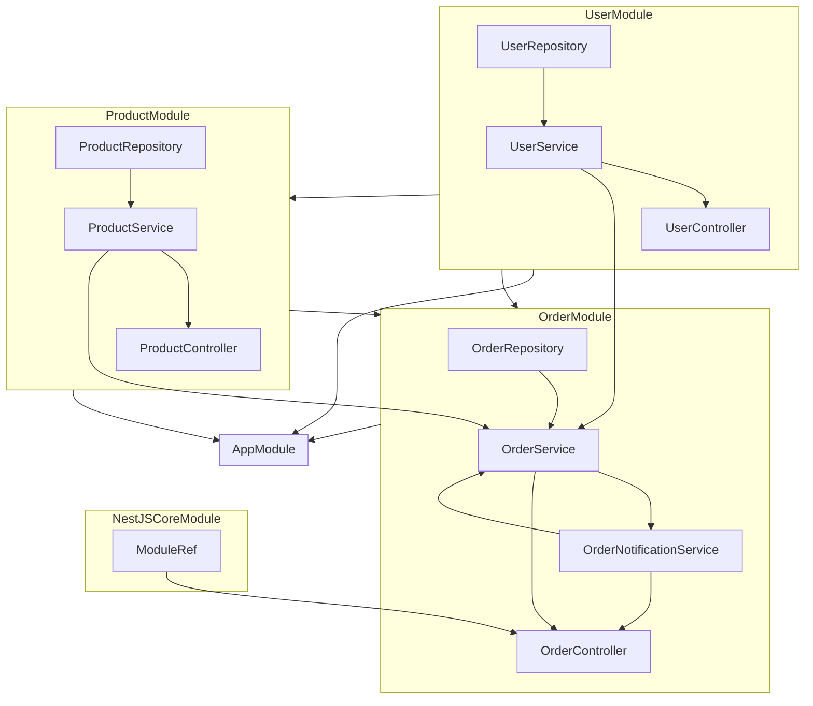

# NestJS Dependency Graph

Root Module: `AppModule`
Version: `1`

## Legend

- Each module is rendered as a Mermaid group
- Inside each module group: providers and controllers owned by that module
- Arrows between groups: imported module points to importing module
- Arrows point from dependency/owned node to the dependent/owner node
- Providers and controllers are grouped inside their owning module without extra ownership arrows
- Internal and external runtime dependencies point to the provider/controller that uses them
- Standalone dependency nodes are only used when a dependency cannot be resolved to a provider node

## AppModule

### Imports
- UserModule
- ProductModule
- OrderModule

### Exports
- None

### Providers
- None

### Controllers
- None

## UserModule

### Imports
- None

### Exports
- UserService

### Providers
- UserService
  - depends on: UserRepository
- UserRepository

### Controllers
- UserController
  - depends on: UserService

## ProductModule

### Imports
- UserModule

### Exports
- ProductService

### Providers
- ProductService
  - depends on: ProductRepository
- ProductRepository

### Controllers
- ProductController
  - depends on: ProductService

## OrderModule

### Imports
- UserModule
- ProductModule

### Exports
- OrderService

### Providers
- OrderRepository
- OrderService
  - depends on: OrderRepository
  - depends on: UserModule:UserService
  - depends on: ProductModule:ProductService
  - depends on: OrderNotificationService
- OrderNotificationService
  - depends on: OrderService

### Controllers
- OrderController
  - depends on: OrderService
  - depends on: NestJSCoreModule:ModuleRef
  - depends on: OrderNotificationService

## NestJSCoreModule

### Imports
- None

### Exports
- ModuleRef

### Providers
- ModuleRef

### Controllers
- None
