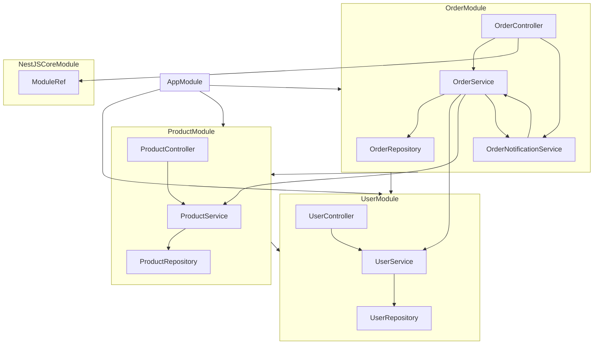

# NestJS Dependency Graph

> Arrow direction: `A --> B` means `A` depends on `B`.

## AppModule

### Imports
- UserModule
- ProductModule
- OrderModule

## UserModule

### Exports
- UserService

### Providers
- UserService
  - depends on UserRepository from UserModule
- UserRepository

### Controllers
- UserController
  - depends on UserService from UserModule

## ProductModule

### Imports
- UserModule

### Exports
- ProductService

### Providers
- ProductService
  - depends on ProductRepository from ProductModule
- ProductRepository

### Controllers
- ProductController
  - depends on ProductService from ProductModule

## OrderModule

### Imports
- UserModule
- ProductModule

### Exports
- OrderService

### Providers
- OrderRepository
- OrderService
  - depends on OrderRepository from OrderModule
  - depends on UserService from UserModule
  - depends on ProductService from ProductModule
  - depends on OrderNotificationService from OrderModule
- OrderNotificationService
  - depends on OrderService from OrderModule

### Controllers
- OrderController
  - depends on OrderService from OrderModule
  - depends on ModuleRef from NestJSCoreModule
  - depends on OrderNotificationService from OrderModule

## NestJSCoreModule

### Exports
- ModuleRef

### Providers
- ModuleRef
