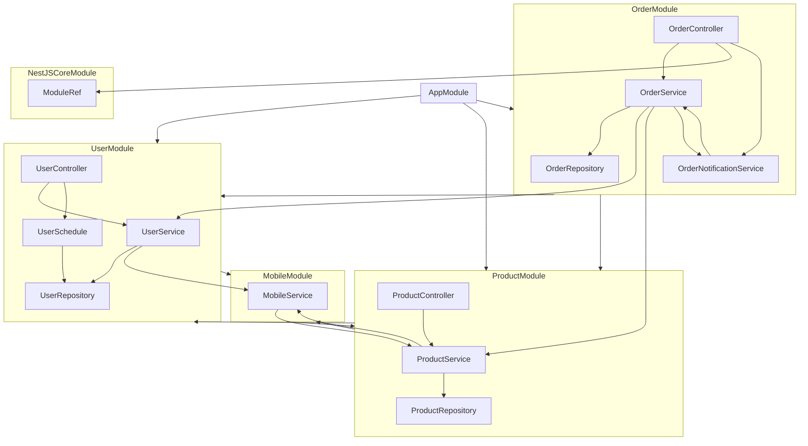

# NestJS Dependency Graph

> Arrow direction: `A --> B` means `A` depends on `B`.

## AppModule

This is playground root module 
that imports the feature modules and the Nest Graph Inspector module.

### Imports
- UserModule
- ProductModule
- OrderModule

## UserModule

UserModule is example feature

> warnings
> - indirect circular dependency with MobileModule

### Imports
- MobileModule

### Exports
- UserService

### Providers
- UserService
  - depends on UserRepository from UserModule
  - depends on MobileService from MobileModule
- UserRepository
- UserSchedule
  scheduler for user module

  - depends on UserRepository from UserModule

### Controllers
- UserController
  - depends on UserService from UserModule
  - depends on UserSchedule from UserModule

## MobileModule

> warnings
> - direct circular dependency with ProductModule

### Imports
- ProductModule

### Exports
- MobileService

### Providers
- MobileService
  - Warning: direct circular dependency with ProductService from ProductModule
  - depends on ProductService from ProductModule

## ProductModule

ProductModule imports UserModule but does NOT use any of its providers.
This is an intentionally useless import to test graph-inspector detection.

### Imports
- UserModule
  - Warning: unused import module
- MobileModule

### Exports
- ProductService

### Providers
- ProductService
  - depends on ProductRepository from ProductModule
  - depends on MobileService from MobileModule
- ProductRepository

### Controllers
- ProductController
  - depends on ProductService from ProductModule

## OrderModule

### Imports
- UserModule
- ProductModule

### Exports
- OrderService

### Providers
- OrderRepository
- OrderService
  - Warning: direct circular dependency with OrderNotificationService from OrderModule
  - depends on OrderRepository from OrderModule
  - depends on UserService from UserModule
  - depends on ProductService from ProductModule
  - depends on OrderNotificationService from OrderModule
- OrderNotificationService
  OrderNotificationService has a circular dependency with OrderService.
  Uses forwardRef in constructor

  - depends on OrderService from OrderModule

### Controllers
- OrderController
  - depends on OrderService from OrderModule
  - depends on ModuleRef from NestJSCoreModule
  - depends on OrderNotificationService from OrderModule

## NestJSCoreModule

### Exports
- ModuleRef

### Providers
- ModuleRef
