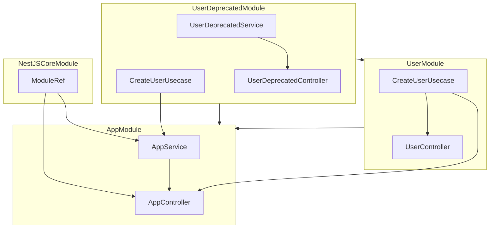

# NestJS Dependency Graph

Root Module: `AppModule`
Version: `1`

## Legend

- Each module is rendered as a Mermaid group
- Inside each module group: providers and controllers owned by that module
- Arrows between groups: imported module points to importing module
- Arrows point from dependency/owned node to the dependent/owner node
- Providers and controllers are grouped inside their owning module without extra ownership arrows
- Internal and external runtime dependencies point to the provider/controller that uses them
- Standalone dependency nodes are only used when a dependency cannot be resolved to a provider node

## AppModule

### Imports
- UserModule
- UserDeprecatedModule

### Exports
- None

### Providers
- AppService
  - depends on: UserDeprecatedModule:CreateUserUsecase
  - depends on: NestJSCoreModule:ModuleRef

### Controllers
- AppController
  - depends on: AppService
  - depends on: NestJSCoreModule:ModuleRef
  - depends on: UserModule:CreateUserUsecase

## UserModule

### Imports
- UserDeprecatedModule

### Exports
- CreateUserUsecase

### Providers
- CreateUserUsecase

### Controllers
- UserController
  - depends on: CreateUserUsecase

## UserDeprecatedModule

### Imports
- None

### Exports
- CreateUserUsecase

### Providers
- UserDeprecatedService
- CreateUserUsecase

### Controllers
- UserDeprecatedController
  - depends on: UserDeprecatedService

## NestJSCoreModule

### Imports
- None

### Exports
- ModuleRef

### Providers
- ModuleRef

### Controllers
- None
